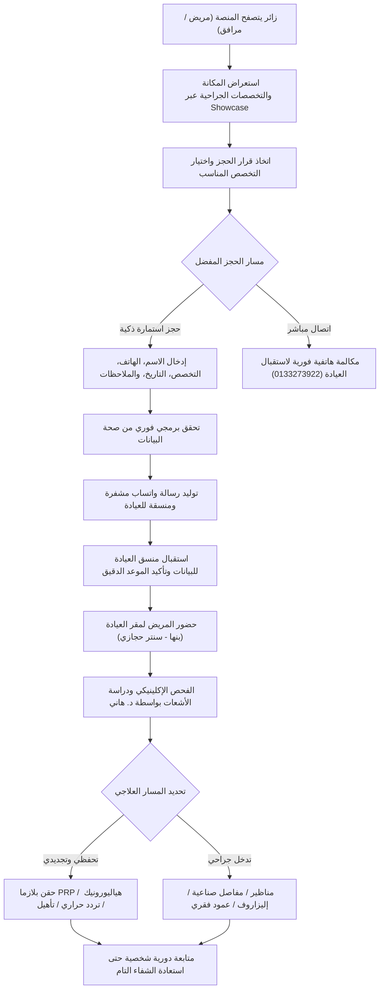
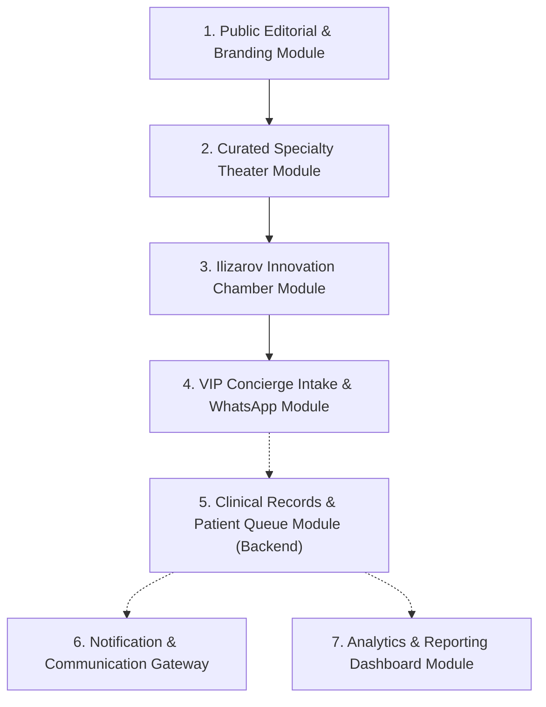
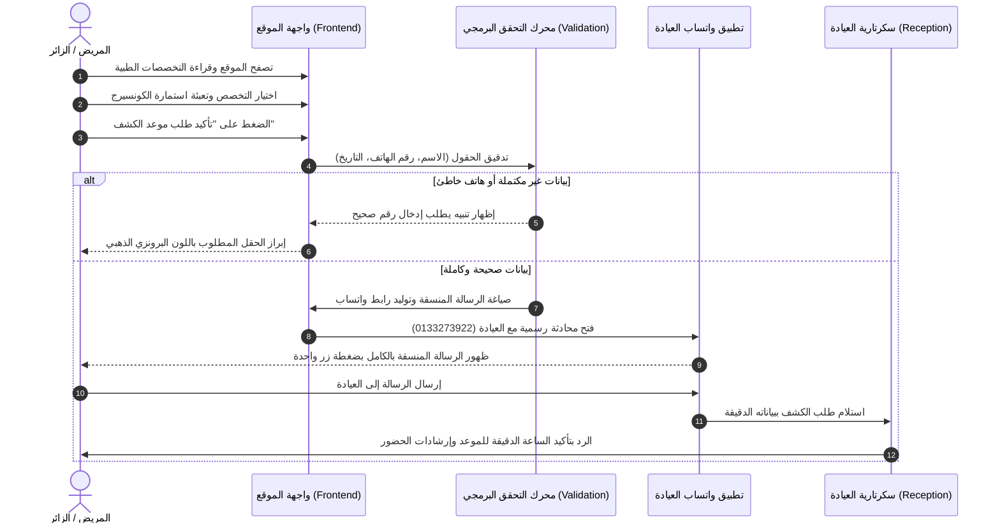
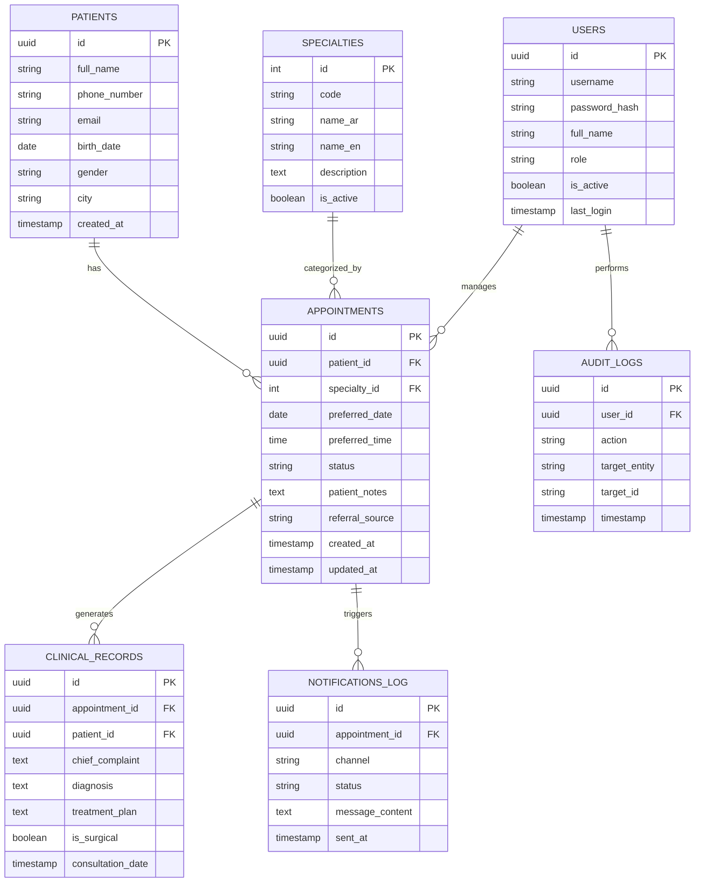

# وثيقة التوصيف الفني والمعماري الشاملة للنظام
# Comprehensive Project & Architecture Documentation

## منظومة وعيادة د. هاني محمد عفيفي لجراحة العظام والمفاصل
### Dr. Hany Mohamed Afify Orthopedic Brand & Clinic Management System

---

## 1. Project Overview (نظرة عامة على المشروع)

### 1.1 اسم المشروع (Project Name)
- **الاسم التجاري والمهني:** عيادة د. هاني محمد عفيفي — استشاري أمراض وجراحة العظام والمفاصل والعمود الفقري.
- **الاسم التقني والمعماري للنظام:** `dr-hany-afify-clinic` (Orthopedic Brand & Patient Intake Concierge System).

### 1.2 فكرة المشروع الأساسية (Core Concept)
منظومة رقمية استشارية متكاملة مصممة خصيصاً كعلامة طبية شخصية ونخبوية (VIP Concierge Medical Brand) تمثل العيادة الاستشارية الخاصة للدكتور هاني محمد عفيفي (حامل درجة دكتوراه جراحة العظام واستشاري جراحات العظام والمفاصل والعمود الفقري وإعادة بناء الأطراف). المنظومة تدمج بين واجهة تعريفية رفيعة المستوى تتبع نمط "الفخامة الهادئة" (Quiet Luxury)، وبوابة حجز وتأهيل استشاري مبكر للمرضى (Patient Triage & Intake Portal).

### 1.3 المشكلة التي يحلها المشروع (Problem Statement)
1. **الصورة النمطية المتواضعة للعيادات التقليدية:** معظم مواقع العيادات تعتمد على قوالب تجارية مكررة وألوان نيونية زرقاء لا تعكس المكانة الأكاديمية والمهنية الرفيعة لطبيب بدرجة دكتوراه، مما يفقدها ثقة الفئات الباحثة عن مستوى استشاري مميز (High-End & VIP Patients).
2. **عشوائية التواصل وتشتت الحجوزات:** اعتماد العيادات على الاتصالات الهاتفية العشوائية دون جمع بيانات مسبقة عن حالة المريض وشكواه وفحوصاته السابقة يؤدي إلى إهدار وقت الطبيب وطاقم الاستقبال.
3. **غياب التثقيف الطبي الموثوق بالتخصصات النادرة:** يجهل الكثير من المرضى طبيعة جراحات التدخل المحدود ومناظير المفاصل وأجهزة بناء وتطويل العظام (جهاز الإليزاروف Ilizarov)، مما يؤخر طلب الاستشارة في الحالات المعقدة وحالات عدم الالتئام (Non-Union).
4. **ضعف تحويل الزوار إلى مرضى فعليين (Low Conversion Rate):** غياب تجربة مستخدم سلسة تربط بين الشرح الإكلينيكي وحجز الموعد الفوري المنسق عبر القنوات المألوفة (واتساب والاتصال المباشر).

### 1.4 الهدف الرئيسي من النظام (Primary Objectives)
- ترسيخ المكانة الأكاديمية والجراحية للدكتور هاني محمد عفيفي كمرجعية استشارية عليا في أمراض وجراحات العظام والمفاصل.
- توفير واجهة حجز وكونسيرج رقمية (Concierge Intake) تجمع بيانات المريض والشكوى بدقة وتحولها آلياً إلى رسائل منسقة لعيادة الطبيب.
- تبسيط وشرح 6 تخصصات جراحية معقدة عبر منصة تفاعلية موحدة تتيح للزائر فهم حالته والاطلاع على البروتوكول العلاجي بدون تشتت.
- استقطاب الحالات المعقدة والمستعصية (تقوس وتشوهات الأطراف، الكسور غير الملتئمة، متطلبات جهاز الإليزاروف) من مختلف المحافظات.

### 1.5 المستخدمون المستهدفون (Target Audience)
1. **المرضى من الفئات الباحثة عن رعاية استشارية خاصة (VIP Patients):** مرضى خشونة المفاصل المتقدمة، آلام العمود الفقري، الانزلاق الغضروفي، والرياضيون المصابون بتمزق الأربطة والغضاريف.
2. **حالات الإصابات والكسور المعقدة والتشوهات:** المرضى المحولون من محافظات مختلفة لعلاج عدم الالتئام العظمي، تفاوت أطوال الأطراف، أو الحاجة لجهاز الإليزاروف.
3. **أولياء أمور الأطفال المصابين بتشوهات النمو:** حالات القدم المخلوبية (Clubfoot)، تقوس الساقين، والخلع الوركي الولادي.
4. **طاقم إدارة العيادة والاستقبال (Clinic Reception & Coordinators):** لتلقي ومتابعة الحجوزات والفرز المبدئي للحالات.

### 1.6 نطاق المشروع الحالي وما هو خارج النطاق (Scope & Boundaries)
- **المُنفذ حالياً ضمن النطاق (Current Phase - In Scope):**
  - الواجهة الرقمية الاستشارية الكاملة المتوافقة مع أجهزة الجوال والحواسيب والشاشات الكبيرة بنظام RTL عربي كامل.
  - المعرض التفاعلي الفاخر للتخصصات الجراحية (The Curated Specialty Showcase) بنظام التبويب اللحظي الخفيف.
  - الجناح الليلي التفاعلي المخصص لهندسة بناء العظام وجهاز الإليزاروف (The Ilizarov Mastery Suite).
  - محرك حجز الكونسيرج (VIP Concierge Intake) مع التحقق البرمجي التلقائي وتوليد روابط ورسائل الواتساب المنسقة مباشرة لرقم العيادة الرسمي (`0133273922`).
  - هوية بصرية مخصصة (Royal Midnight Navy `#0A1324` و Champagne Gold `#C29D59` و Warm Pearl `#FBF9F5`).
  - البنية التحتية للاستضافة السحابية عبر Vercel Edge ومستودع الكود عبر GitHub.
- **خارج النطاق الحالي ومحدد للمراحل القادمة (Phase 2 - Out of Current Scope):**
  - نظام السجلات الطبية الإلكترونية الكاملة (Full EHR/EMR) وتخزين ملفات الأشعات والرنين المغناطيسي على خوادم مخصصة.
  - بوابة الدفع الإلكتروني المباشر (Online Payment Gateways) لتأكيد الحجوزات بالبطاقات البنكية.
  - نظام إدارة الصيدلية الداخلية والمخزون.

---

## 2. Business Understanding (الفهم التجاري ودورة العمل)

### 2.1 دورة العمل الكاملة (End-to-End Business Process)


### 2.2 رحلة المستخدم (User Journey: Patient Experience)
1. **مرحلة الاكتشاف والانطباع الأول (Discovery & Authority):** يصل المريض للموقع عبر محركات البحث أو منصات التواصل أو توصية طبية. يستقبله الغلاف الرئاسي (Hero) بصورة حقيقية موقرة للدكتور وشارات الاعتماد الأكاديمي (`دكتوراه جراحة العظام`) وشريط القياسات الإكلينيكية (`+15,000` استشارة، `+20` عاماً من الخبرة).
2. **مرحلة التقييم والتثقيف (Evaluation & Credo):** يقرأ المريض فلسفة الرعاية التي تركز على التحفظ والتشخيص السببي المباشر قبل أي جراحة، مما يبني الثقة النفسية فوراً ويخفف مخاوف الجراحة غير الضرورية.
3. **مرحلة استكشاف التخصص المناسب (Curated Exploration):** عبر منصة العرض التفاعلية (Showcase)، يضغط الزائر على تخصصه (مثل: استبدال المفاصل أو مناظير الركبة) فيرى فوراً الشرح الإكلينيكي وقائمة المزايا والصورة الطبية دون الحاجة لفتح صفحات جديدة.
4. **مرحلة تقديم طلب الحجز (Conversion & Intake):** ينتقل المريض لاستمارة الكونسيرج الخاصة، يملأ اسمه ورقم هاتفه والموعد المقترح، وبضغطة زر ينتقل إلى محادثة واتساب رسمية مجهزة بالكامل ومكتوبة باللغة العربية مع طاقم استقبال د. هاني.
5. **مرحلة التنسيق والاستقبال (Coordination & Visit):** يقوم سكرتير العيادة بالاطلاع على تفاصيل الرسالة، تحديد الساعة الدقيقة للحضور، وتزويد المريض بإرشادات الحضور وإحضار الأشعات والفحوصات السابقة.

### 2.3 السيناريوهات الرئيسية للاستخدام (Key Use Cases)
- **سيناريو 1: مريض خشونة الركبة المزمنة الباحث عن بديل للجراحة:** يتصفح قسم الطب التجديدي وحقن البلازما، ويطلب استشارة لتقييم درجات التآكل ومعرفة إمكانية تطبيق التردد الحراري.
- **سيناريو 2: رياضي مصاب بقطع الرباط الصليبي أو الغضروف الهلالي:** يستعرض قسم مناظير المفاصل والتدخل المحدود وجراحة اليوم الواحد، ويطلب موعداً عاجلاً للتقييم الرياضي.
- **سيناريو 3: مريض يعاني من كسر مضاعف غير ملتئم أو تشوه في الساق:** يدخل قسم جهاز الإليزاروف والكسور المعقدة، ويدرك الخبرة الجراحية النادرة للدكتور هاني في هذا المجال، مما يدفعه لحجز استشارة متقدمة.
- **سيناريو 4: ولي أمر يبحث عن تصحيح تقوس أو قدم مخلوبية لطفل حديث الولادة:** يدخل جناح عظام الأطفال ويطلع على تطبيق بروتوكول بونسيتي التحفظي وتقويم مراكز النمو بأمان.

### 2.4 القواعد الحاكمة وقواعد العمل (Business Rules)
- **قاعدة BR-01 (إلزامية الحجز المسبق):** لا يُسمح بالدخول العشوائي للعيادة دون حجز وتأكيد مسبق، وذلك لضمان تخصيص وقت استشاري كافٍ وفحص غير متعجل لكل حالة.
- **قاعدة BR-02 (سلامة رقم الهاتف):** يجب أن يتطابق رقم الهاتف المدخل مع نسق أرقام الجوال المصرية المعتمدة (11 رقماً تبدأ بـ 010, 011, 012, 015) أو نسق الاتصال الدولي لضمان إمكانية التواصل الفوري عبر الواتساب.
- **قاعدة BR-03 (تاريخ الكشف المقترح):** لا يسمح النظام باختيار تاريخ في الماضي؛ الحد الأدنى لاختيار موعد الكشف هو اليوم الحالي (`min = Today`).
- **قاعدة BR-04 (أولوية الحالات الطارئة):** يتم تمييز حالات الكسور الحادة وحوادث الأطراف من خلال خيار الشكوى ليتم إعطاؤها أولوية في التنسيق من قِبل منسق العيادة.

---

## 3. User Roles & Permissions (الأدوار والصلاحيات)

لضمان معيارية النظام وقابليته للترقية في Phase 2 إلى بوابة إدارة كاملة للعيادة (Clinic Portal)، تم تعريف مصفوفة الأدوار والصلاحيات (RBAC - Role-Based Access Control) على النحو التالي:

### 3.1 جدول الأدوار والصلاحيات التفصيلي

| الدور (Role) | الوصف ونطاق العمل | صلاحيات العرض (View) | صلاحيات الإنشاء والإدخال (Create) | صلاحيات التعديل (Update) | صلاحيات الحذف (Delete) |
|---|---|---|---|---|---|
| **الزائر / المريض (End User / Patient)** | الجمهور العام والباحثون عن الرعاية الطبية | المحتوى العام، التخصصات، مقالات الإليزاروف، بيانات المقر | إنشاء طلب كشف استشاري وإرساله | تعديل بيانات الحجز الخاصة به قبل الإرسال فقط | غير مصرح |
| **سكرتارية العيادة والاستقبال (Clinic Receptionist)** | موظفو الاستقبال وتنسيق المواعيد | قائمة الحجوزات الواردة، سجل المرضى، أوقات الفراغ في الجدول | تسجيل حجز يدوي للمرضى عبر الهاتف أو الحضور المباشر | تحديث حالة الحجز (مؤكد، ملغي، حضر، مؤجل) | غير مصرح بالحذف النهائي (أرشفة فقط) |
| **مدير العمليات / المنسق الإكلينيكي (Clinic Manager)** | الإشراف الإداري على حجوزات العيادة وسير العمل | السجلات الإدارية، تقارير الحجوزات، تحليلات التحويل، سجل النشاط | إنشاء حسابات للموظفين، إضافة أوقات دوام العيادة والعطلات | تعديل أوقات العمل، أسعار الكشوفات، وتعديل بيانات المرضى | إلغاء أو أرشفة الحجوزات والسجلات |
| **الدكتور هاني محمد عفيفي / المدير التقني (Super Admin / Consultant)** | الطبيب الاستشاري وصاحب الصلاحية المطلقة | النظام بالكامل، الملفات الطبية السرية، التقارير الإحصائية والمالية | إضافة السجلات الإكلينيكية والتشخيصات الجراحية والمحتوى الطبي | تعديل كافة الإعدادات والتشخيصات والبيانات وتخصيص الموقع | الصلاحية الكاملة لحذف أو أرشفة أي سجل في النظام |

---

## 4. System Modules (الوحدات البرمجية للنظام)

تم تصميم النظام بنمط الوحدات المستقلة المترابطة (Modular Architecture):



### 4.1 Module 1: وحدة الهوية التحريرية والتثقيف الاستشاري (Public Editorial & Branding)
- **الهدف:** بناء الثقة وتقديم د. هاني محمد عفيفي بمكانته الأكاديمية الاستشارية عبر تجربة بصرية فائقة الفخامة.
- **الوظائف:** عرض الغلاف الرئاسي (Hero)، شريط المقاييس الإكلينيكية، بيان الأمانة الطبية وفلسفة الفحص السببي (Credo)، ومسار رحلة المريض الراقية (Journey).
- **العلاقات:** تمد وحدة الحجز بالمصداقية التي ترفع معدل التحويل (Conversion Rate).

### 4.2 Module 2: مسرح التخصصات التفاعلي الموحد (Curated Specialty Theater)
- **الهدف:** عرض التخصصات الستة الكبرى دون ملل أو تكرار، في شاشة تفاعلية واحدة سريعة الاستجابة.
- **الوظائف:**
  - التبديل الفوري بين التخصصات عبر 6 أزرار تبويب ناعمة (المفاصل الصناعية، مناظير المفاصل، علاج الخشونة بالطب التجديدي، جراحات العمود الفقري، الكسور المعقدة، عظام الأطفال).
  - عرض الصورة الطبية، الشارة الدولية، العنوان التحريري، الشرح الإكلينيكي المكثف، وقائمة الإجراءات الطبية المتبعة.
  - زر حجز مباشر مخصص يحمل التخصص المختار تلقائياً إلى استمارة الحجز.
- **العلاقات:** ترتبط مباشرة مع وحدة استمارة الحجز (Module 4) لتمرير نوع التخصص تلقائياً.

### 4.3 Module 3: جناح جهاز الإليزاروف والابتكار الجراحي (The Ilizarov Mastery Suite)
- **الهدف:** إبراز التخصص النادر للدكتور هاني في جراحات بناء وتطويل العظام وتصحيح التشوهات وتقنية الحلقة الخارجية.
- **الوظائف:** عرض الرسوم التخطيطية الهندسية لجهاز الإليزاروف، وشرح ميكانيزمات تطويل الأطراف وسد الفجوات العظمية وعلاج حالات عدم الالتئام المزمن (Non-union).
- **العلاقات:** توفر زراً مخصصاً لحجز استشارات التشوهات العظمية المعقدة.

### 4.4 Module 4: وحدة كونسيرج الحجز وتنسيق الواتساب (VIP Concierge Intake & WhatsApp Dispatcher)
- **الهدف:** جمع بيانات المرضى الراغبين في الاستشارة، التحقق من صحتها، وتحويلها لرسالة واتساب منسقة ورسمية موجهة لعيادة الطبيب.
- **الوظائف:**
  - فحص حقول الإدخال (الاسم، الهاتف، التخصص، التاريخ المقترح، الملاحظات).
  - ضبط حد أدنى لتاريخ الكشف لمنع التواريخ الماضية.
  - تشفير النص العربي بنظام `encodeURIComponent` وتوليد رابط `wa.me/20133273922?text=...`.
  - تفريغ الاستمارة فور الإرسال لضمان عدم تكرار الطلب بدون قصد.
- **العلاقات:** تمثل نقطة الالتقاء بين واجهة المستخدم العامة وفريق استقبال العيادة.

### 4.5 Module 5: وحدة إدارة المرضى وسجل الكشوفات (Patient Queue & EHR - Backend Extension)
- **الهدف:** استقبال وتخزين كافة الحجوزات الصادرة من المنظومة في قاعدة بيانات سحابية وتوزيعها على جدول العيادة الأسبوعي.
- **الوظائف:** تخزين بيانات المريض، أرشفة الشكوى الطبية، ربط المريض برقم ملف عائلي أو شخصي، وإدارة قائمة الانتظار اليومية.

### 4.6 Module 6: بوابة الرسائل والإشعارات التلقائية (Notification & Messaging Gateway)
- **الهدف:** إرسال إشعارات التأكيد والتذكير للمرضى وتنبيه فريق الاستقبال بالحجوزات الجديدة.
- **الوظائف:** إرسال رسائل SMS أو رسائل WhatsApp Cloud API تلقائية قبل موعد الكشف بـ 24 ساعة لتأكيد الحضور.

---

## 5. User Flow (مخطط تدفق المستخدم وحالات الاستخدام)



### 5.1 حالات النجاح والفشل (Success & Failure States)
- **حالة النجاح (Primary Happy Path):** يملأ المريض الحقول بشكل سليم، يضغط زر التأكيد، يفتح المتصفح نافذة واتساب جديدة برابط مشفر يحتوي على كافة البيانات، يضغط المريض "إرسال"، وتستقبل العيادة الطلب فورياً في أقل من دقيقة.
- **حالة الإدخال الناقص (Validation Failure):** إذا ترك المريض حقل الاسم أو الهاتف فارغاً، يمنع المتصفح الإرسال عبر خصائص HTML5 Validation و JavaScript Alert، ويتم تركيز المؤشر على الحقل الناقص مع وميض الحدود باللون الذهبي.
- **حالة عدم توفر تطبيق واتساب (Fallback Action):** إذا كان المريض يتصفح من جهاز لا يحتوي على واتساب، توفر الواجهة في نفس اللحظة زر اتصال هاتفي مباشر على رقم العيادة الأرضي/المحمول (`0133273922`) بنقرة واحدة `tel:0133273922`.

---

## 6. Screens & UI Requirements (شاشات النظام ومتطلبات الواجهة)

تم تصميم واجهات النظام وفق أعلى معايير الـ UI/UX المعاصرة المتبعة في كبرى المنصات العالمية:

### 6.1 الشاشة 1: شاشة البوابة الاستشارية الرئيسية (Public Portal Screen)
- **الهدف:** تعريف شامل بدكتور هاني، بناء الهيبة الإكلينيكية، تثقيف المريض، وجذب طلبات الكشف.
- **العناصر والمكونات (UI Components):**
  1. **الشريط العلوي (Master Header):**
     - شعار العيادة المقتطع بدقة مع اسم الدكتور ودرجته الأكاديمية (`دكتوراه جراحة العظام`).
     - قائمة روابط سريعة مع تأثير التتبع النشط (Scrollspy Indicator).
     - رقم الهاتف السريع وزر طلب موعد خاص باللون الذهبي الشامبين.
  2. **الغلاف الرئاسي (Imperial Hero Cover):**
     - شارة الخدمة النخبوية مع نقطة نبض ذهبية متحركة.
     - العنوان الرئيسي: *«رعاية استشارية فائقة الدقة.. تليق بصحتكم وحريتكم الحركية»*.
     - بطاقة اعتماد استشاري ثلاثية الأسطر مع خط برونزي جانبي.
     - صورة حقيقية للدكتور هاني داخل إطار ملكي ذي حد ذهبي ولمعان ثلاثي الأبعاد تفاعلي مع حركة الماوس (`3D Tilt Frame`).
     - بطاقة حالة HUD سفلية توضح نظام المواعيد الحصرية في سنتر حجازي ببنها.
     - شريط أرقام القياسات الإكلينيكية المختصرة (`+15,000` استشارة، `+20` عاماً من الخبرة، `دكتوراه`).
  3. **بطاقة الفلسفة والأمانة الطبية (Credo Grand Card):**
     - اقتباس عريض يبرز أولوية التشخيص المعمق والحلول التحفظية.
     - 3 ركائز مميزة بأرقام رومانية كلاسيكية (`I`, `II`, `III`).
  4. **مسرح التخصصات الفاخر (Specialty Showcase Stage):**
     - شريط تبويبات أفقي قابل للتمرير السلس على الجوال يحتوي على 6 تخصصات.
     - مساحة عرض ديناميكية تحتوي على صورة فوتوغرافية طبية، شارة إنجليزية دولية، عنوان التخصص، الشرح الإكلينيكي، قائمة من 4 مزايا مؤكدة، وزر حجز موجه للتخصص.
  5. **جناح جهاز الإليزاروف الملكي (The Ilizarov Suite):**
     - خلفية كحلي ملكي داكنة مع توهج خافت.
     - 4 كروت HUD دقيقة تشرح تقنيات توليد العظام، تصحيح التشوهات، تطويل الأطراف، وعلاج عدم الالتئام.
     - رسم تخطيطي تفاعلي لجهاز الإليزاروف مع إشارات توضيحية بالأبعاد.
  6. **مسار الاستقبال النخبوي (Patient Journey Track):**
     - 4 كروت عاجية متناسقة تشرح خطوات المريض (الفحص، الأشعة، الخطة، والمتابعة).
  7. **جناح الحجز الخاص (VIP Appointment Lounge):**
     - استمارة الحجز الأنيقة مع الحقول المنسقة.
     - بطاقة تفاصيل المقر والهاتف ومواعيد العمل.
  8. **التذييل الملكي (Royal Footer):**
     - نبذة عن العلامة، روابط التخصصات، أرقام التواصل، وحقوق الملكية 2026.

### 6.2 الحقول ومتطلبات التدقيق (Field Validation Matrix)

| اسم الحقل (Field) | المعرّف (ID) | نوع المدخل (Type) | المتطلب (Requirement) | قاعدة التحقق (Validation Rule) | رسالة الخطأ (Error State) |
|---|---|---|---|---|---|
| **اسم المريض** | `f_name` | `text` | إلزامي (Mandatory) | الحد الأدنى 3 أحرف، حروف عربية/إنجليزية ومسافات | يرجى كتابة اسم المريض الثلاثي أو الثنائي بشكل صحيح |
| **رقم الهاتف المحمول** | `f_phone` | `tel` | إلزامي (Mandatory) | أرقام فقط، لا يقل عن 10 أرقام، تقبل نسق `01xxxxxxxxx` | يرجى إدخال رقم هاتف محمول متاح للتواصل |
| **التخصص المطلوب** | `f_service` | `select` | اختياري (له افتراضي) | اختيار من ضمن قائمة التخصصات الـ 8 المعتمدة | يتم اختيار التخصص الافتراضي تلقائياً |
| **الموعد المقترح** | `f_date` | `date` | اختياري | تاريخ مستقبلي فقط (`min >= Current Date`) | لا يمكن اختيار تاريخ سابق لموعد اليوم |
| **ملاحظات الحالة** | `f_notes` | `textarea` | اختياري | نص حر بحد أقصى 500 حرف لوصف الأعراض | الحد الأقصى 500 حرف |

---

## 7. Database Design (تصميم قاعدة البيانات المقترح للمنظومة)

لتوفير قابلية بناء نظام متكامل (Full-Stack Enterprise EHR & Booking System)، تم وضع المخطط الكياني العلائقي (ERD) المتوافق مع محركات قواعد البيانات الحديثة (PostgreSQL / MySQL / Supabase):

### 7.1 جدول الكيانات والجداول (Entities & Tables)



### 7.2 التوصيف التفصيلي للأعمدة وأنواع البيانات (Schema Data Dictionary)

#### 1. جدول المرضى (`patients`)
- `id` (UUID, Primary Key, Default: `gen_random_uuid()`): المعرف الفريد للمريض.
- `full_name` (VARCHAR(150), NOT NULL): اسم المريض بالكامل.
- `phone_number` (VARCHAR(20), NOT NULL, UNIQUE, INDEX): رقم هاتف المريض المعتمد.
- `email` (VARCHAR(100), NULL): البريد الإلكتروني (إن وجد).
- `birth_date` (DATE, NULL): تاريخ ميلاد المريض لحساب العمر الإكلينيكي.
- `gender` (VARCHAR(10), CHECK: `gender IN ('male', 'female')`): الجنس.
- `city` (VARCHAR(50), DEFAULT: 'بنها'): المحافظة أو المدينة التابع لها المريض.
- `created_at` (TIMESTAMPTZ, DEFAULT: `NOW()`): وقت إنشاء السجل.

#### 2. جدول التخصصات (`specialties`)
- `id` (SERIAL, Primary Key): المعرف الرقمي للتخصص.
- `code` (VARCHAR(30), UNIQUE, NOT NULL): الرمز البرمجي (مثل: `ARTHROPLASTY`, `ILIZAROV`, `SPINE`).
- `name_ar` (VARCHAR(100), NOT NULL): اسم التخصص بالعربية.
- `name_en` (VARCHAR(100), NOT NULL): اسم التخصص بالإنجليزية.
- `description` (TEXT): الشرح الاستشاري للخدمة.
- `is_active` (BOOLEAN, DEFAULT: `TRUE`): تفعيل أو تعطيل ظهور التخصص.

#### 3. جدول طلبات ومواعيد الكشف (`appointments`)
- `id` (UUID, Primary Key, Default: `gen_random_uuid()`): معرف طلب الحجز.
- `patient_id` (UUID, NOT NULL, FOREIGN KEY -> `patients.id` ON DELETE RESTRICT): معرف المريض.
- `specialty_id` (INT, NOT NULL, FOREIGN KEY -> `specialties.id`): معرف التخصص المطلوب.
- `preferred_date` (DATE, NOT NULL): التاريخ الذي حدده المريض مبدئياً.
- `scheduled_time` (TIME, NULL): الوقت الفعلي المؤكد للحضور بواسطة الاستقبال.
- `status` (VARCHAR(20), DEFAULT: 'pending', CHECK: `status IN ('pending', 'confirmed', 'attended', 'cancelled', 'no_show')`): حالة الحجز.
- `patient_notes` (TEXT, NULL): ملاحظات الشكوى والأعراض التي كتبها المريض.
- `created_at` (TIMESTAMPTZ, DEFAULT: `NOW()`): تاريخ إرسال الطلب.
- `updated_at` (TIMESTAMPTZ, DEFAULT: `NOW()`): تاريخ آخر تعديل على حالة الموعد.

#### 4. جدول السجلات والتشخيصات الطبية (`clinical_records`)
- `id` (UUID, Primary Key): معرف الفحص الإكلينيكي.
- `appointment_id` (UUID, FOREIGN KEY -> `appointments.id`): الموعد المرتبط.
- `patient_id` (UUID, FOREIGN KEY -> `patients.id`): المريض المفحوص.
- `chief_complaint` (TEXT, NOT NULL): شكوى المريض الرئيسية.
- `diagnosis` (TEXT, NOT NULL): التشخيص الطبي للدكتور هاني محمد عفيفي.
- `treatment_plan` (TEXT, NOT NULL): الخطة العلاجية المعتمدة (تحفظية، منظارية، جراحية).
- `is_surgical` (BOOLEAN, DEFAULT: `FALSE`): هل تتطلب الحالة تدخلاً جراحياً أم علاجاً تحفظياً.
- `consultation_date` (TIMESTAMPTZ, DEFAULT: `NOW()`): تاريخ ووقت الفحص في العيادة.

#### 5. جدول مستخدمي الإدارة (`users`)
- `id` (UUID, Primary Key): معرف الموظف/الطبيب.
- `username` (VARCHAR(50), UNIQUE, NOT NULL): اسم المستخدم لتسجيل الدخول.
- `password_hash` (VARCHAR(255), NOT NULL): كلمة المرور مشفرة بخوارزمية `Argon2id` أو `bcrypt`.
- `full_name` (VARCHAR(100), NOT NULL): الاسم ثلاثي.
- `role` (VARCHAR(20), CHECK: `role IN ('admin', 'manager', 'receptionist')`): الصلاحية الإدارية.
- `is_active` (BOOLEAN, DEFAULT: `TRUE`): تفعيل أو إيقاف الحساب.
- `last_login` (TIMESTAMPTZ, NULL): توقيت آخر تسجيل دخول.

---

## 8. Backend Architecture (معمارية الخادم والـ APIs المقترحة)

### 8.1 بيئة التشغيل والهيكل الموصى به (Technology & Design Pattern)
- **البيئة الموصى بها:** Node.js (TypeScript) باستخدام إطار عمل **Fastify** أو **NestJS** لضمان أعلى سرعة استجابة ومعيارية برمجية، أو Python باستخدام **FastAPI** في حال دمج خوارزميات تحليل صور الأشعة مستقبلاً.
- **نمط التصميم (Architecture Pattern):** معمارية الطبقات النظيفة (Clean Layered Architecture):
  - `Controller Layer`: استقبال طلبات HTTP والتحقق من الـ Schema باستخدام `Zod`.
  - `Service Layer`: تنفيذ منطق العمليات الطبية (Business Logic) والتحقق من توافر المواعيد.
  - `Repository / Data Layer`: استعلامات قاعدة البيانات باستخدام ORM حديث مثل `Prisma` أو `Drizzle`.

### 8.2 خريطة نقاط النهاية الأساسية (Core API Endpoints Specification)

#### 1. نقاط نهاية الحجوزات العامة (Public Booking Endpoints)
- **`POST /api/v1/appointments/intake`**
  - **الوصف:** استقبال طلب حجز موعد جديد من استمارة الكونسيرج العامة.
  - **مستوى الوصول:** عام (Public مع Rate Limiting).
  - **جسم الطلب (Request Payload):**
    ```json
    {
      "patient_name": "أحمد محمود سالم",
      "patient_phone": "01012345678",
      "specialty_code": "ARTHROPLASTY",
      "preferred_date": "2026-10-05",
      "notes": "آلام حادة ومستمرة في مفصل الركبة اليمنى وصعوبة في صعود الدرج"
    }
    ```
  - **الاستجابة الناجحة (Response 201 Created):**
    ```json
    {
      "status": "success",
      "booking_reference": "HA-202610-8492",
      "whatsapp_redirect_url": "https://wa.me/20133273922?text=...",
      "message": "تم تسجيل بيانات طلب الحجز بنجاح"
    }
    ```

- **`GET /api/v1/specialties`**
  - **الوصف:** جلب قائمة التخصصات الجراحية النشطة وتفاصيلها المحدثة.
  - **مستوى الوصول:** عام (مخزن مؤقتاً عبر CDN Cache لمدة 24 ساعة).

#### 2. نقاط نهاية إدارة العيادة المحمية (Protected Clinic Endpoints)
- **`POST /api/v1/auth/login`**
  - **الوصف:** تسجيل دخول موظف الاستقبال أو الطبيب والحصول على Access Token مشفر (JWT).
- **`GET /api/v1/admin/appointments`**
  - **الوصف:** استعراض قائمة الحجوزات مع إمكانية الفلترة بحسب التاريخ أو التخصص أو الحالة (`pending`, `confirmed`).
  - **الصلاحية المطلوبة:** `receptionist` فأعلى.
- **`PATCH /api/v1/admin/appointments/:id/status`**
  - **الوصف:** تحديث حالة الموعد وتأكيد الساعة المحددة للحضور.
- **`POST /api/v1/admin/patients/:id/clinical-records`**
  - **الوصف:** حفظ التشخيص الطبي والخطة العلاجية للدكتور هاني.
  - **الصلاحية المطلوبة:** `admin` (د. هاني فقط).

### 8.3 معالجة الأخطاء (Error Handling Standards)
تتبع واجهات البرمجة معيار **RFC 7807 (Problem Details for HTTP APIs)** بحيث تعود الأخطاء دائماً بالنسق الموحد:
```json
{
  "type": "https://dr-hany-afify.clinic/errors/invalid-phone-format",
  "title": "Invalid Phone Number Format",
  "status": 400,
  "detail": "رقم الهاتف المدخل غير صالح، يرجى إدخال رقم هاتف محمول مصري مكون من 11 رقماً",
  "instance": "/api/v1/appointments/intake"
}
```

---

## 9. Frontend Architecture (معمارية الواجهة الأمامية)

### 9.1 بنية الكود البرمجي الحالي (Current Architecture)
يعتمد المشروع الحالي على معمارية **Jamstack فائقة السرعة وخفيفة الحجم (Zero-Dependency Vanilla Architecture)**، لضمان تحميل الصفحة في أقل من 0.5 ثانية على شبكات الجوال من مختلف أنحاء مصر، وبدون الاعتماد على مكتبات ضخمة تعيق تجربة المستخدم.

```
d:\Dr - Hany Afify\
├── index.html               # الهيكل الدلالي الدقيق (Semantic HTML5 RTL)
├── css\
│   └── style.css            # نظام التصميم الأرستقراطي الملكي (Bespoke Luxury CSS)
├── js\
│   └── main.js              # المحرك التفاعلي للأحداث والحجوزات (Vanilla ES6+)
├── assets\
│   └── images\              # الصور الفوتوغرافية، الرسوم المتجهة، والشعارات
└── vercel.json              # إعدادات النشر السحابي و Clean URLs
```

### 9.2 نظام التصميم ومحرك الأنماط (CSS Design System Tokens)
يستند ملف `css/style.css` إلى متغيرات تصميم موحدة (Custom Properties):
- **الألوان الهادئة الفخمة:**
  - `--bg-pearl: #FBF9F5` (الخلفية اللؤلؤية المريحة).
  - `--navy-royal: #0A1324` (الكحلي الملكي الحبري للهيبة والسلطة).
  - `--gold-champagne: #C29D59` (الذهب الشامبين المصقول للأزرار والشارات).
  - `--border-hairline: #E8E2D6` (الخطوط الشعرية الفاصلة الهادئة).
- **الطباعة المتجاوبة (Fluid Typography):**
  - العناوين الرئيسية مبنية بـ `clamp(2.3rem, 3.8vw, 3.4rem)` لتتكيف بدقة متناهية مع شاشات الهواتف والأجهزة اللوحية دون أي انكسار للأسطر.

### 9.3 إدارة الحالة والتفاعل (State Management & UI Logic in `main.js`)
1. **تتبع التمرير اللحظي (Scroll Tracer):** حساب نسبة التمرير عمودياً وتحديث مؤشر الخط الذهبي العلوي بنسبة `scaleX(progress)`.
2. **شريط التنقل المرتفع الذكي (Header Elevation & Scrollspy):** تتبع موضع الأقسام تلقائياً وإضافة كلاس `.scrolled` و `.active` للرابط المقابل دون وميض.
3. **محرك مسرح التخصصات (Showcase Tabs Switcher):**
   - استماع لأحداث النقر على أزرار التبويب الستة `.showcase-tab-btn`.
   - قراءة السمة `data-target` للوصول إلى الحاوية المطابقة `#tab-*`.
   - إزالة الفعالية عن بقية التبويبات وإظهار التبويب المطلوب بانسيابية تامة عبر `fade & translateY`.
4. **محرك الظهور التدريجي (IntersectionObserver Reveal Engine):** مراقبة دخول العناصر في مجال الرؤية وتفعيل كلاس `.revealed` لضمان حركات ظهور سينمائية متتابعة بنظام 60 إطاراً في الثانية.
5. **محرك حجز الكونسيرج ومولد رسائل الواتساب (VIP Concierge Dispatcher):** قراءة المدخلات وتنسيق رسالة منظمة باللغة العربية وإطلاق محادثة واتساب الرسمية في نافذة جديدة.

---

## 10. Integrations (أنظمة الربط الخارجي)

| النظام الخارجي (Integration) | البروتوكول / الطريقة | الهدف من الربط | الحالة الحالية | الخطة المستقبلية |
|---|---|---|---|---|
| **واتساب (WhatsApp Deep Linking)** | `wa.me/20133273922?text={encoded_msg}` | استقبال استمارة الحجز من المريض بضغطة زر واحدة كرسالة منسقة رسمية | مُفعل وشغال في الإنتاج | الترقية إلى **WhatsApp Business Cloud API** لاستقبال الحجوزات وإصدار التذاكر آلياً |
| **بروتوكول الهاتف المباشر (Tel URI)** | `tel:0133273922` | تمكين المريض من الاتصال الفوري باستقبال العيادة بنقرة واحدة من الجوال | مُفعل وشغال في الإنتاج | ربط المنظومة بسنترال سحابي ذكي (Cloud PBX / VoIP) لتسجيل وتوزيع المكالمات |
| **استضافة Vercel السحابية** | Vercel CLI & Git Integration | نشر التحديثات فورياً على شبكة خوادم Vercel العالمية مع دعم شهادات SSL وتوزيع CDN | مُفعل وشغال في الإنتاج | ربط دومين خاص رئيسي مخصص للعيادة (مثل: `drhanyafify.com`) |
| **خطوط Google Fonts العالمية** | HTTPS CDN (Cairo & Tajawal) | تحميل الخطوط العربية الفاخرة المعتمدة في النظام البصري بأعلى سرعة | مُفعل وشغال في الإنتاج | تضمين ملفات الـ WOFF2 محلياً (Self-hosted) لتقليص استدعاءات الـ DNS الخارجية |
| **بوابات الدفع الإلكتروني (Payment Gateways)** | REST API (Webhooks / Hosted Checkout) | تحصيل رسوم جدية الحجز مقدماً لتقليل نسبة عدم الحضور (No-Shows) | غير مفعل حالياً | ربط بوابات دفع محلية ودولية (Paymob, Fawry, Apple Pay, Visa/Mastercard) |

---

## 11. Notifications & Automation (الإشعارات والأتمتة)

### 11.1 مصفوفة الإشعارات المعتمدة

| نوع الإشعار (Notification) | الحدث المشغّل (Trigger Event) | المستقبل (Recipient) | القناة (Channel) | نموذج نص الرسالة (Template) |
|---|---|---|---|---|
| **طلب حجز جديد** | قيام المريض بالضغط على "تأكيد طلب موعد الكشف" | سكرتارية واستقبال العيادة | تطبيق WhatsApp المعتمد | `*طلب حجز موعد استشاري خاص — عيادة د. هاني محمد عفيفي*`<br>`---------------------------------------`<br>`👤 اسم المريض: {name}`<br>`📞 رقم الهاتف: {phone}`<br>`🩺 التخصص: {service}`<br>`📅 الموعد المقترح: {date}`<br>`📝 الملاحظات: {notes}` |
| **تأكيد الموعد للمريض** | مراجعة السكرتارية وتحديد الساعة بالجدول | المريض | WhatsApp / SMS | `أهلاً بك أستاذ {name}. تم تأكيد موعد كشفك الاستشاري بعيادة د. هاني محمد عفيفي يوم {date} الساعة {time}. المقر: بنها - سنتر حجازي بجوار المحكمة - الدور الثالث.` |
| **تذكير بالموعد (24 ساعة)** | حلول موعد الزيارة خلال 24 ساعة (Cron Job) | المريض | WhatsApp / SMS | `تذكير بموعد كشفك الاستشاري غداً مع د. هاني محمد عفيفي في تمام الساعة {time}. يرجى إحضار كافة الأشعات والفحوصات السابقة لضمان التشخيص الدقيق.` |
| **متابعة ما بعد الفحص (Post-Op Care)** | مرور أسبوع على العملية أو جلسة الحقن | المريض | WhatsApp التفاعلي | `نرجو أن تكون بصحة ممتازة. يتابع فريق د. هاني محمد عفيفي حالتك؛ يرجى طمأنتنا على حركتك والتزامك بتمارين التأهيل، والتواصل معنا حال وجود أي استفسار.` |

---

## 12. Reports & Dashboards (التقارير ولوحات التحكم الإحصائية)

لتمكين الدكتور هاني وإدارة العيادة من اتخاذ قرارات دقيقة مبنية على البيانات (Data-Driven Decisions)، يتضمن النظام المستقبلي لوحة تحكم تعرض المؤشرات الإكلينيكية والتسويقية التالية:

### 12.1 مؤشرات الأداء الرئيسية (Key Performance Indicators - KPIs)
1. **معدل تحويل الزوار إلى مرضى (Visitor-to-Lead Conversion Rate):**
   $$\text{Conversion Rate} = \left(\frac{\text{إجمالي طلبات الحجز المرسلة}}{\text{إجمالي زوار الموقع الفريدين}}\right) \times 100$$
2. **توزيع الحالات بحسب التخصص الجراحي (Specialty Distribution Breakdown):**
   - نسبة حالات تغيير المفاصل الصناعية (Arthroplasty).
   - نسبة حالات مناظير الركبة والكتف والرباط الصليبي (Arthroscopy).
   - نسبة حالات جهاز الإليزاروف والكسور المعقدة والتشوهات (Ilizarov & Complex Cases).
   - نسبة حالات علاج الخشونة والطب التجديدي (Cartilage & PRP).
   - نسبة حالات جراحات العمود الفقري وعرق النسا (Spine).
   - نسبة حالات عظام الأطفال والتشوهات (Pediatric Orthopedics).
3. **معدل تأكيد وحضور المواعيد (Show-up Rate vs No-Show):** نسبة المرضى الذين حضروا بالفعل للعيادة بعد إرسال طلب الحجز.
4. **التوزيع الجغرافي للمرضى (Geographic Reach):** نسبة المرضى القادمين من محافظة القليوبية مقابل المحافظات الأخرى (المرضى المحولون لحالات الإليزاروف المعقدة).

---

## 13. Security Requirements (الأمان والسرية وحماية البيانات)

نظراً لحساسية البيانات الطبية وخصوصية المرضى النخبويين، تم وضع الاشتراطات الأمنية التالية وفق معايير **HIPAA** وقانون حماية البيانات الشخصية المصري:

1. **سرية بيانات المرضى (Confidentiality & Privacy):**
   - لا يتم نشر أي بيانات تخص المرضى أو أسمائهم أو هواتفهم في أي مكان عام.
   - رسائل الواتساب مشفرة طرفياً (End-to-End Encrypted) عبر بروتوكولات شركة Signal المعتمدة في تطبيق WhatsApp.
2. **أمان النقل والتشفير (Transport Security - TLS/SSL):**
   - المنظومة تعمل بالكامل ببروتوكول **HTTPS** الإلزامي مع شهادة أمان SSL/TLS مشفرة بمفتاح 256-bit.
   - تفعيل رأس الأمان `Strict-Transport-Security` (HSTS) لمنع أي محاولات تنزيل البروتوكول لـ HTTP غير المشفر.
3. **الوقاية من هجمات الحقن والاختراق (Input Sanitization & XSS Prevention):**
   - يتم تدقيق كافة المدخلات في الواجهة الأمامية والخلفية وتطهيرها لمنع هجمات Cross-Site Scripting (XSS) أو SQL Injection.
   - عدم استخدام أي دوال خطرة مثل `eval()` أو `innerHTML` غير الموثوقة في معالجة بيانات المريض.
4. **منع الإغراق ورسائل السبام (Rate Limiting & Anti-Spam):**
   - فرض قيود زمنية على استمارة الحجز لمنع برمجيات البوت (Bots) من إرسال طلبات حجز وهمية متتالية.
5. **سجل التدقيق والمتابعة (Audit Logging):**
   - في النسخة الكاملة من المنظومة، يتم تسجيل هوية أي مستخدم يقوم بفتح أو استعراض السجل الطبي لأي مريض، وتوثيق توقيت وتاريخ الوصول لمنع أي تسريب للمعلومات الطبية.

---

## 14. Technical Stack (البنية التقنية التفصيلية)

### 14.1 البنية المنفذة حالياً في الإنتاج (Current Production Stack)
- **واجهة المستخدم (Frontend):** Pure Semantic HTML5 (RTL Native), Modern CSS3 Design Tokens (Custom Properties, Glassmorphism, CSS Grid, Flexbox), Vanilla Modern JavaScript (ES6+).
- **الخطوط والطباعة (Typography):** Google Fonts CDN (`Cairo` للألقاب والعناوين الملكية، و `Tajawal` للمتون والنصوص السردية).
- **الأيقونات والرسوم (Graphics):** Scalable Vector Graphics (SVG) للرسوم التشريحية وجهاز الإليزاروف، مع صور فوتوغرافية محسنة للويب بصيغة JPG/PNG.
- **إدارة الإصدارات (Version Control):** Git ومستودع GitHub الرسمي:  
  `https://github.com/AbdelmenemSayed/dr-hany-afify-clinic`
- **الاستضافة والنشر السحابي (Cloud Hosting & CDN):** منصة **Vercel Edge Network** مع تفعيل الروابط النظيفة (Clean URLs) عبر `vercel.json`.
- **نطاق الإنتاج الحي (Live Production URL):**  
  `https://dr-hany-afify-clinic.vercel.app`

### 14.2 البنية المستهدفة للتوسعة الكاملة (Target Full-Stack Enterprise Architecture)
- **الواجهة الأمامية (Future Frontend):** إما الاستمرار بالمعمارية الحالية لخفتها وسرعتها، أو ترقيتها إلى **Next.js (App Router)** في حال الرغبة في بناء بوابة دخول خاصة بالمرضى (Patient Portal) لتسجيل الدخول ومتابعة ملفات الأشعة.
- **الخلفية وقواعد البيانات (Future Backend & DB):**
  - الخادم: Node.js / NestJS أو Serverless Functions على Vercel/AWS Lambda.
  - قاعدة البيانات: **PostgreSQL** المستضافة على Supabase أو AWS RDS مع حماية السجلات وتشفيرها (Encryption at Rest).
  - التخزين السحابي للأشعات والفحوصات: **Amazon S3** أو **Cloudflare R2** بأسماء مشفرة وروابط مؤقتة مسبقة التوقيع (Pre-signed URLs).

---

## 15. Future Enhancements & Scalability (التحسينات المستقبلية وقابلية التوسع)

1. **بوابة المريض الرقمية لملفات الأشعة (Patient Portal & Imaging Hub):**
   - تمكين المريض من رفع صور أشعة الرنين المغناطيسي (MRI) والأشعة السينية (X-Rays) وصور التحاليل مباشرة بصيغة DICOM أو PDF قبل الحضور، ليطلع عليها الدكتور هاني مسبقاً قبل دخول المريض.
2. **نظام شاشات الانتظار الذكية داخل العيادة (Digital Queue Display):**
   - شاشة عرض أنيقة داخل صالة الاستقبال بالعيادة تعرض رقم المريض الحالي ووقت الدخول المتوقع دون مناداة صوتية، مع تشغيل فيديوهات توعوية هادئة عن جراحات المفاصل والإليزاروف.
3. **الدفع الإلكتروني وتأكيد الحجز الفوري (Digital Booking Deposit):**
   - خيار اختياري لدفع رسوم الحجز عبر المحافظ الإلكترونية المصرية (فودافون كاش، فوري، ميزة) أو البطاقات الائتمانية.
4. **توسعة الفروع والمراكز الجراحية (Multi-Branch Architecture):**
   - تهيئة النظام لإدارة أكثر من فرع (مثل: فرع بنها، وفرع القاهرة/المهندسين أو التجمع مستقبلاً) مع جدول مواعيد مستقل لكل مركز.
5. **المساعد الطبي الذكي للفرز الأولي (AI Orthopedic Triage Assistant):**
   - روبوت محادثة ذكي ومقيد طبياً يستفسر من المريض عن مكان الألم ومدته وطبيعته، ويوجهه تلقائياً للقسم المناسب (مثل: ركبة، عمود فقري، أو إليزاروف) قبل توجيهه للواتساب.

---

## 16. Final Project Summary (الملخص المعماري النهائي للمشروع)

### 16.1 كيف تعمل أجزاء النظام معاً؟
نظام عيادة د. هاني محمد عفيفي ليس مجرد صفحة ويب تعريفية، بل هو **منظومة متكاملة للتسويق الطبي الاستشاري وإدارة الاستقبال النخبوي**:
1. يدخل الزائر إلى واجهة مصممة بطراز "الفخامة الهادئة والوقار الأكاديمي" تبدد شكوكه وتبني الثقة الفورية عبر استعراض المؤهلات والخبرات الجراحية.
2. يتفاعل المريض مع **مسرح التخصصات (Showcase)** فيتعرف على بروتوكول علاجه بدقة في ثوانٍ معدودة دون تشتت.
3. ينتقل المريض إلى **جناح الحجز الخاص (Concierge Lounge)**، حيث يتم تدقيق مدخلاته برمجياً وتحويلها فوراً إلى محادثة واتساب موثقة ومنسقة تصل هاتف العيادة الرسمي.
4. يستقبل فريق العيادة الطلب ويثبته في جدول دكتور هاني، مما يوفر على الطرفين وقتاً ثميناً ويضمن استقبال المريض في بيئة استشارية راقية تليق بصحته.

### 16.2 أهم النقاط التي يجب أن يفهمها أي مهندس أو فريق عمل جديد (Handover Notes):
1. **فلسفة التصميم خط أحمر:** يجب ألا يتم تشويه الهوية البصرية بألوان نيونية فاقعة أو كروت جاهزة رخيصة؛ النظام مبني على التناسق الملكي (الكحلي الملكي الحبري `#0A1324`، الذهب الشامبين `#C29D59`، والعاجي اللؤلؤي `#FBF9F5`).
2. **الأصول والصور الحقيقية:** تم حفظ وتضمين الصورة الحقيقية للدكتور هاني وشعار العيادة الأصلي داخل `assets/images/`؛ أي تعديل مستقبلي يجب أن يحافظ على دقة وسلامة هذه الملفات.
3. **بساطة وسرعة الكود:** تم بناء النظام بدون مكتبات خارجية ثقيلة (Zero Framework Overhead) لتحقيق درجة سرعة 100/100 على الجوال؛ حافظ دائماً على خفة الكود واختبر الأداء بعد أي ميزة جديدة.
4. **رقم العيادة المعتمد:** الرقم الرسمي للواتساب والاتصال هو `0133273922` (أو بالصيغة الدولية `20133273922`) ومقر العيادة الدائم: **بنها – سنتر حجازي بجوار المحكمة – الدور الثالث**.

---
*تم إعداد هذه الوثيقة وفق المعايير البرمجية والهندسية العالمية لتكون المرجع الرسمي الكامل لبناء وتطوير وإدارة منصة عيادة د. هاني محمد عفيفي.*
